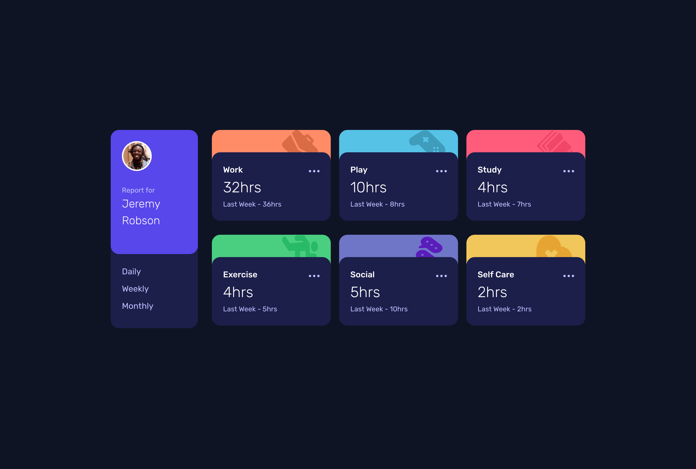

# Frontend Mentor - Time tracking dashboard solution

This is a solution to the [Time tracking dashboard challenge on Frontend Mentor](https://www.frontendmentor.io/challenges/time-tracking-dashboard-UIQ7167Jw). Frontend Mentor challenges help you improve your coding skills by building realistic projects.

## Table of contents

- [Overview](#overview)
  - [The challenge](#the-challenge)
  - [Screenshot](#screenshot)
  - [Links](#links)
- [My process](#my-process)
  - [Built with](#built-with)
  - [What I learned](#what-i-learned)
  - [Continued development](#continued-development)
  - [Useful resources](#useful-resources)
- [Author](#author)
- [Acknowledgments](#acknowledgments)

## Overview

### The challenge

Users should be able to:

- View the optimal layout for the site depending on their device's screen size
- See hover states for all interactive elements on the page
- Switch between viewing Daily, Weekly, and Monthly stats

### Screenshot



### Links

- Solution URL: [Time Tracking solution URL](https://github.com/mayor-creator/time_tracking_dashboard_component)
- Live Site URL: [Time Tracking live site](https://time-tracking-dashboard-component.vercel.app/)

## My process

### Built with

- Semantic HTML5 markup
- CSS custom properties
- Flexbox
- CSS Grid
- Mobile-first workflow

### What I learned

```js
const handleMonthlyData = async () => {
	const fetchData = "../data.json";
	const response = await fetch(fetchData);
	try {
		if (!response.ok) {
			alert("Something went wrong. Please try again.");
			return;
		}
		const data = await response.json();
		monthlyData(data);
	} catch (error) {
		console.log(error);
	}
};
```

### Continued development

- Building more project with fetch api
- Sass

### Useful resources

- [Using the Fetch API](https://developer.mozilla.org/en-US/docs/Web/API/Fetch_API/Using_Fetch?utm_medium=firefox-desktop&utm_source=firefox-suggest&utm_campaign=firefox-mdn-web-docs-suggestion-experiment&utm_content=treatment) - This helped me to understand how to use the fetch api

## Author

- Frontend Mentor - [@mayor-creator](https://www.frontendmentor.io/profile/mayor-creator)
- Threads - [@mayor_creator](https://www.threads.net/@mayor_creator)

## Acknowledgments
